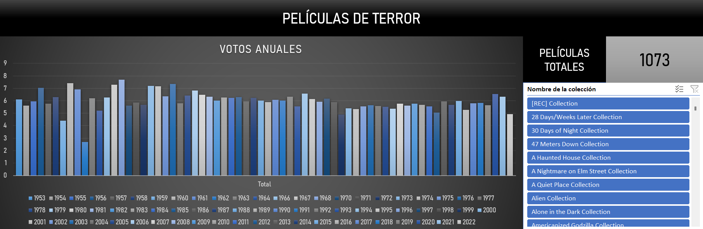

# 🎬 Horror Movies — Análisis de Datos

Análisis exploratorio de una base de datos de películas de terror mediante **Microsoft Excel**, utilizando técnicas de limpieza y transformación de datos, estadística descriptiva, tablas dinámicas y un dashboard para identificar patrones relacionados con las valoraciones, fechas de lanzamiento y características de las películas.

---

## 📌 Descripción del proyecto

Este proyecto parte de un dataset original de **32.540 películas** y tiene como objetivo realizar un proceso de **limpieza, filtrado y análisis exploratorio de datos** para obtener un conjunto final de películas de terror con información suficientemente completa para realizar el análisis.

Tras el proceso de preparación de los datos, se obtuvo una tabla final de **1.073 películas**, sobre la que se realizaron diferentes análisis estadísticos y visualizaciones mediante Excel.

El proyecto incluye:

* Limpieza y filtrado del dataset original.
* Eliminación de columnas no necesarias para el análisis.
* Transformación de determinadas variables.
* Creación de una variable calculada.
* Análisis estadístico descriptivo.
* Creación de tablas dinámicas.
* Análisis de las valoraciones de las películas.
* Análisis de la evolución de las valoraciones a lo largo del tiempo.
* Creación de un dashboard interactivo en Excel.

---

# 🗃️ Dataset original

El proyecto parte del archivo:

```text
horror_movies.csv
```

El dataset original contiene:

* **32.540 filas**
* **20 columnas**

Este archivo constituye la fuente de datos utilizada para construir la tabla final del proyecto.

---

# 🧹 Limpieza y preparación de los datos

Uno de los principales objetivos del proyecto fue transformar el dataset original en un conjunto de datos más adecuado para el análisis.

El proceso de limpieza permitió pasar de:

```text
32.540 películas
        ↓
Proceso de filtrado y limpieza
        ↓
1.073 películas
```

Por tanto, se conservaron **1.073 registros**, eliminándose **31.467 filas** del dataset original.

## 🔎 Criterios de filtrado

Para garantizar que las películas utilizadas en el análisis dispusieran de información básica necesaria, se aplicaron los siguientes filtros:

```text
status = Released
budget > 0
revenue > 0
runtime > 0
```

Es decir, se conservaron únicamente las películas que:

* Hubieran sido estrenadas.
* Tuvieran un presupuesto registrado mayor que 0.
* Tuvieran ingresos registrados mayores que 0.
* Tuvieran una duración registrada mayor que 0 minutos.

Este proceso redujo considerablemente el número de registros, pero permitió trabajar con un conjunto de datos más consistente para el análisis posterior.

---

## 🗑️ Eliminación de columnas

El dataset original contenía **20 columnas**.

Durante la preparación de los datos se eliminaron tres columnas que no eran necesarias para el análisis:

```text
poster_path
backdrop_path
collection
```

Después de esta eliminación, se conservaron **17 columnas originales**.

Posteriormente se añadió una nueva variable calculada, dando como resultado las **18 columnas finales** utilizadas en Excel.

---

## 🔄 Transformaciones realizadas

Además del filtrado de filas y eliminación de columnas, se realizaron algunas transformaciones sobre los datos.

### Popularidad

La variable `popularity` fue redondeada a números enteros para facilitar su visualización y utilización en el análisis.

Ejemplo:

| CSV original | Excel |
| -----------: | ----: |
|        9,272 |     9 |
|        0,600 |     1 |
|       15,868 |    16 |

---

## ➕ Variable calculada

Se añadió una nueva variable denominada:

```text
Estado de Éxito (Función condicional)
```

Esta variable se creó mediante una función condicional de Excel para clasificar las películas según los criterios establecidos en el proyecto.

De esta forma, además de las variables originales, el dataset final incorpora una variable derivada específicamente para el análisis.

---

# 📊 Dataset final

Después del proceso de limpieza y transformación, la tabla utilizada en Excel contiene:

| Característica                  | Resultado |
| ------------------------------- | --------: |
| Filas iniciales                 |    32.540 |
| Filas finales                   |     1.073 |
| Filas eliminadas                |    31.467 |
| Columnas iniciales              |        20 |
| Columnas eliminadas             |         3 |
| Columnas originales conservadas |        17 |
| Columnas calculadas añadidas    |         1 |
| Columnas finales                |        18 |

Las 1.073 películas del dataset final corresponden a registros existentes en el CSV original.

---

# 🗂️ Estructura del archivo Excel

El proyecto está desarrollado en:

```text
Horror Movies.xlsx
```

El archivo contiene las siguientes hojas:

### 1. `Tabla`

Contiene el conjunto de datos final después del proceso de limpieza y transformación.

Entre las principales variables se encuentran:

| Variable            | Descripción                                         |
| ------------------- | --------------------------------------------------- |
| `id`                | Identificador de la película                        |
| `original_title`    | Título original                                     |
| `title`             | Título de la película                               |
| `original_language` | Idioma original                                     |
| `overview`          | Sinopsis                                            |
| `tagline`           | Eslogan                                             |
| `release_date`      | Fecha de lanzamiento                                |
| `popularity`        | Indicador de popularidad                            |
| `vote_count`        | Número de votos                                     |
| `vote_average`      | Valoración media                                    |
| `budget`            | Presupuesto                                         |
| `revenue`           | Ingresos                                            |
| `runtime`           | Duración en minutos                                 |
| `status`            | Estado de la película                               |
| `adult`             | Indicador de contenido adulto                       |
| `genre_names`       | Géneros asociados                                   |
| `collection_name`   | Colección o franquicia                              |
| `Estado de Éxito`   | Variable calculada mediante una función condicional |

---

### 2. `Análisis de datos`

Esta hoja contiene un análisis estadístico descriptivo de la variable:

```text
vote_average
```

Se calcularon las siguientes medidas:

* Media
* Error típico
* Mediana
* Moda
* Desviación estándar
* Varianza
* Curtosis
* Coeficiente de asimetría
* Rango
* Mínimo
* Máximo
* Suma
* Número de observaciones

### Principales resultados

| Estadístico         | Resultado |
| ------------------- | --------: |
| Media               |      5,79 |
| Mediana             |      6,00 |
| Moda                |      6,00 |
| Desviación estándar |      1,70 |
| Mínimo              |      0,00 |
| Máximo              |     10,00 |
| Rango               |     10,00 |
| Nº de películas     |     1.073 |

La valoración media del conjunto analizado es aproximadamente **5,79 sobre 10**.

---

### 3. `Tablas dinámicas y Dashboard`

Esta hoja contiene las tablas dinámicas utilizadas para explorar los datos y un **dashboard visual**.

Entre los análisis realizados se encuentra la evolución del promedio de `vote_average` según el **año de lanzamiento**, permitiendo observar cómo varían las valoraciones de las películas a lo largo del periodo analizado.

También se utilizan tablas dinámicas para resumir y explorar diferentes características del conjunto de datos.

---

# 📊 Dashboard

El proyecto incluye un dashboard desarrollado en Excel a partir de tablas dinámicas.

El objetivo del dashboard es presentar los principales resultados del análisis de una manera visual e interactiva, facilitando la exploración de los datos.

<p align="center">
  
</p>

---

# 🛠️ Herramientas utilizadas

* **Microsoft Excel**
* Power Query
* Power Pivot
* Dashboard
* Tablas dinámicas
* Estadística descriptiva
* Funciones condicionales
* Limpieza y transformación de datos
* Análisis exploratorio de datos

---

# 🚀 Cómo utilizar el proyecto

1. Descarga o clona este repositorio.
2. Abre `Horror Movies.xlsx` con Microsoft Excel.
3. Accede a la hoja `Tabla` para consultar los datos preparados.
4. Revisa `Análisis de datos` para consultar las métricas estadísticas.
5. Accede a `Tablas dinámicas y Dashboard` para explorar las visualizaciones y tablas dinámicas.

El archivo `horror_movies.csv` puede utilizarse como referencia para consultar el dataset original y comparar el proceso de limpieza con el conjunto final utilizado en el análisis.

---

# 📁 Estructura del repositorio

```text
Proyecto_I-MariaG/
│
├── data/
│   └── horror_movies.csv
│
├── images/
│   └── dashboard.png
│
├── Horror Movies.xlsx
│
└── README.md
```

---

# 👤 Autor

**[María Gómez]**
